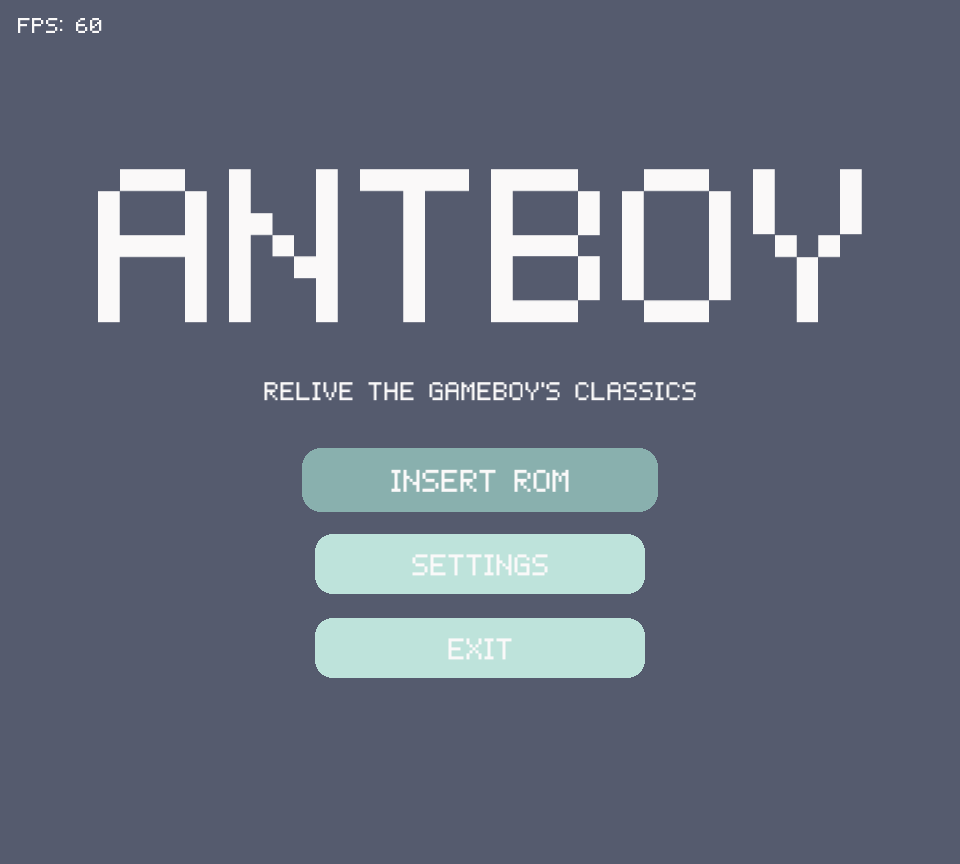
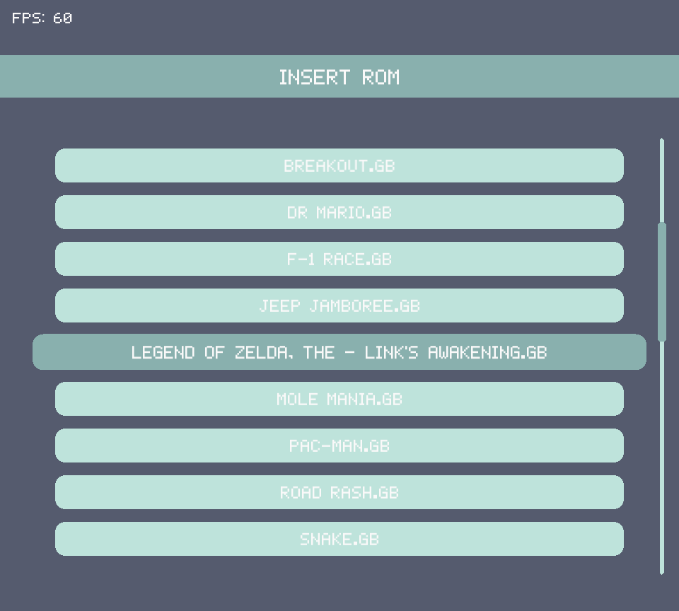
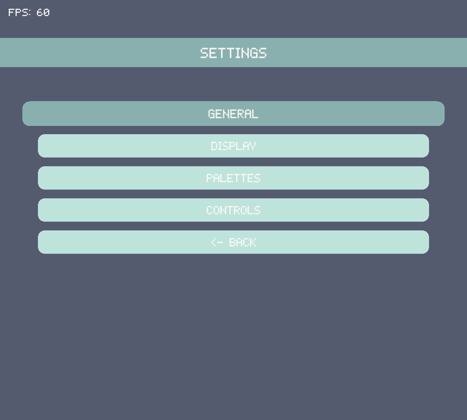
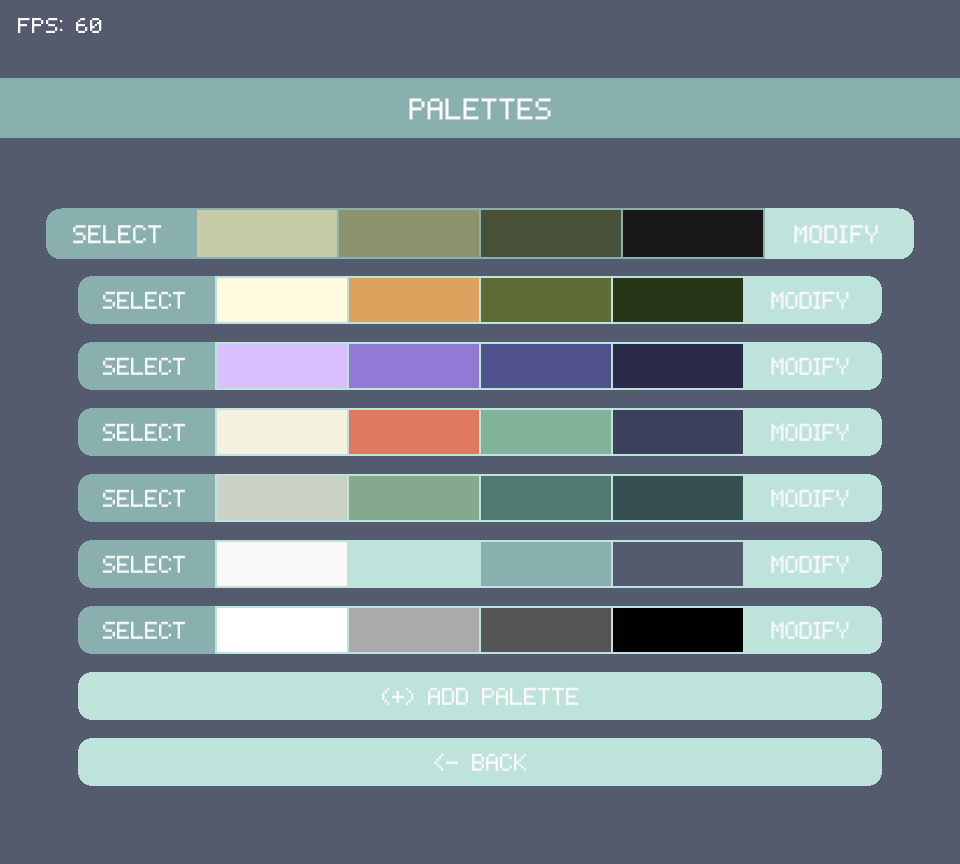
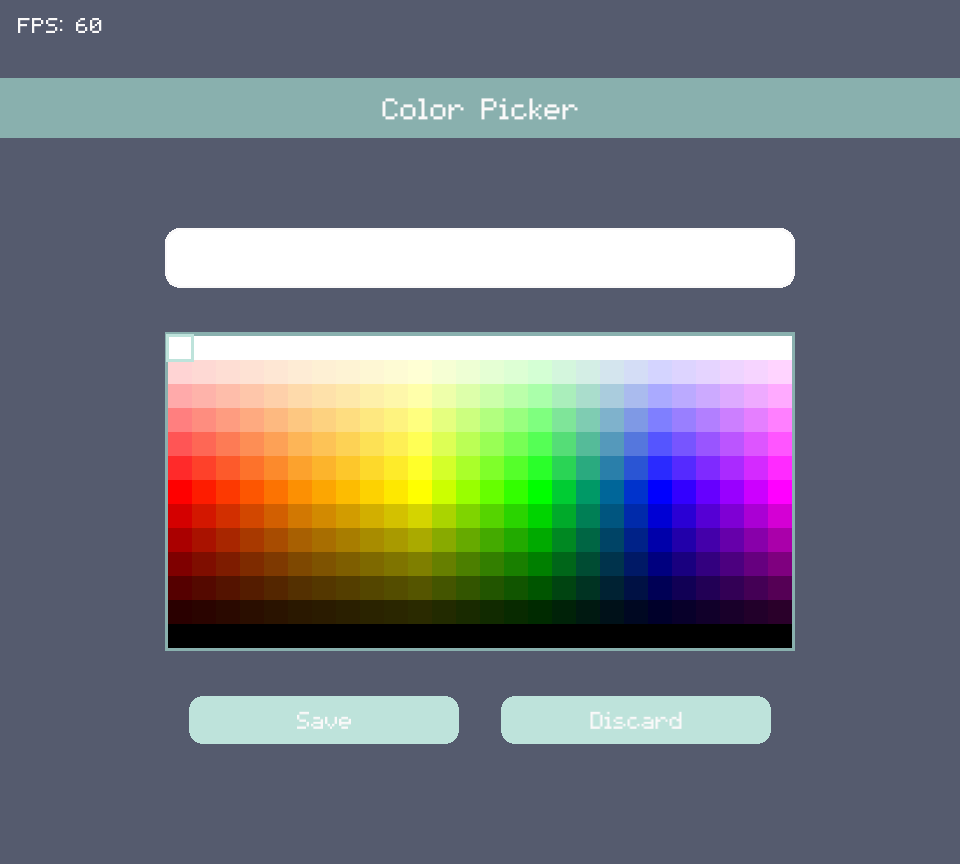
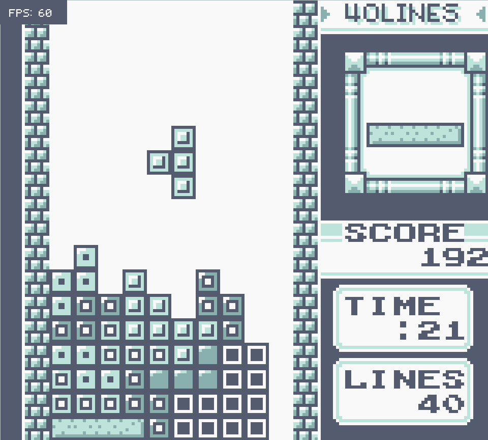
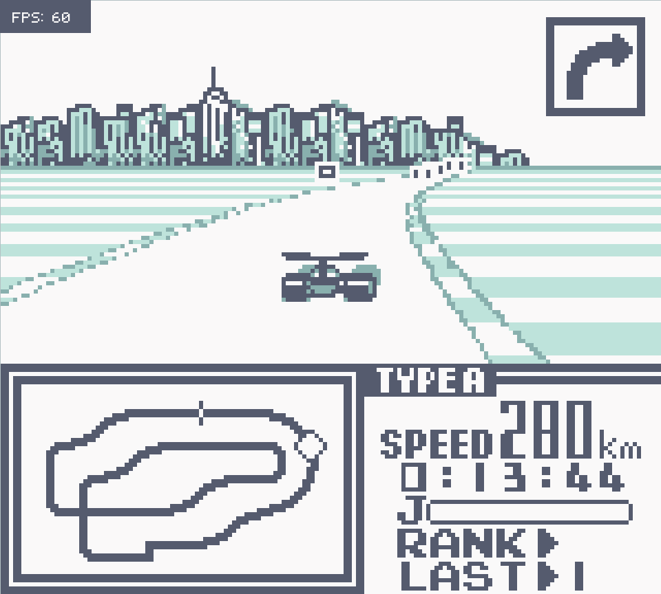
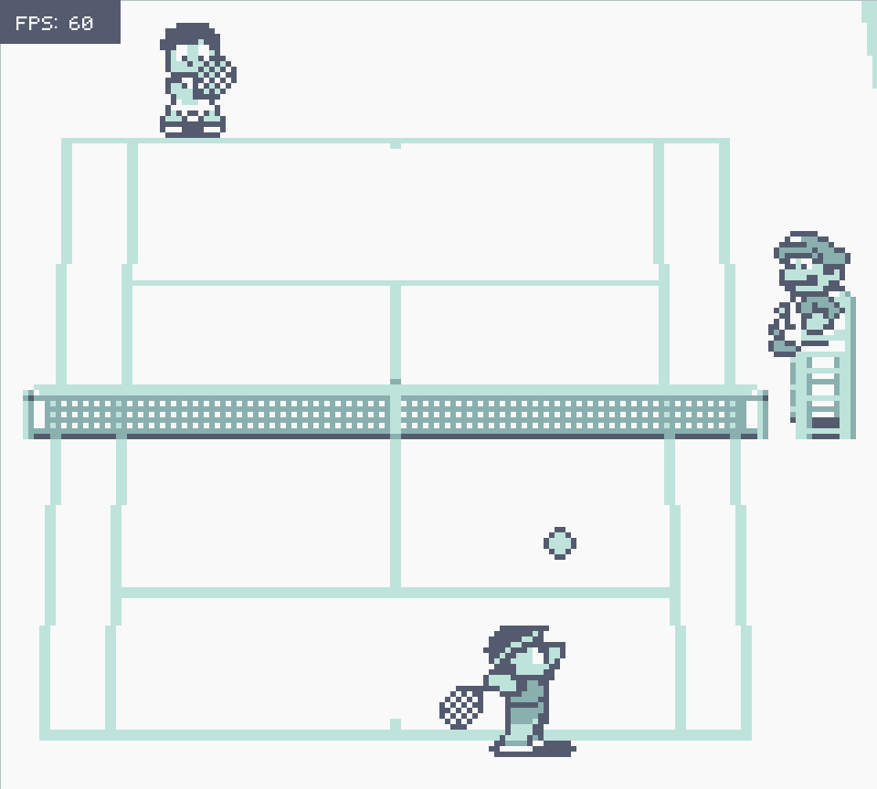
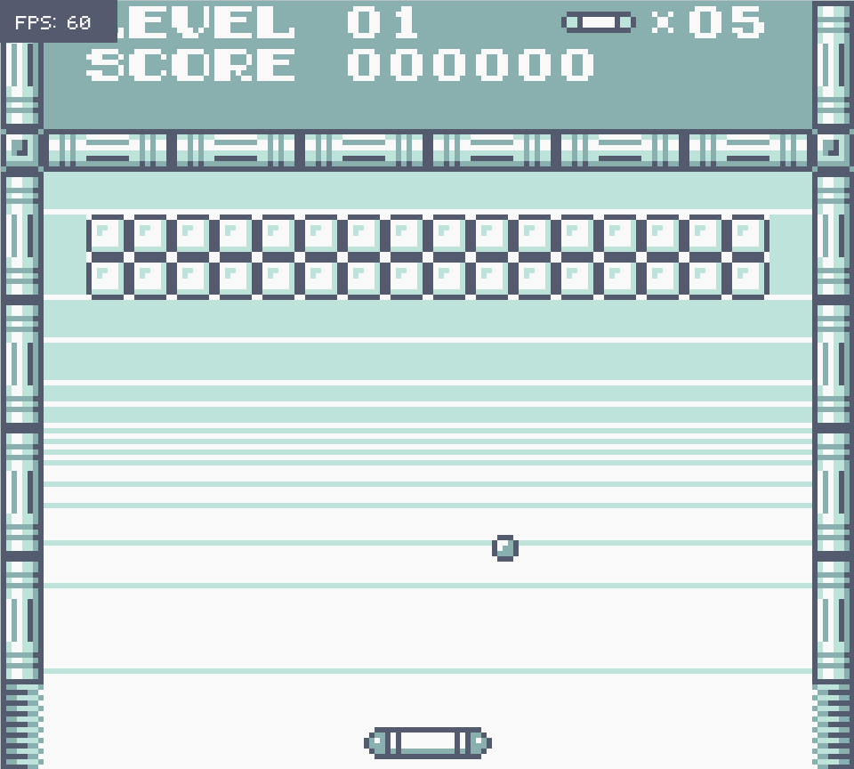

# `Antboy - C++ Gameboy Emulator`

## `Overview`
This project is my AQA Computer Science NEA submission. As a long-time fan of classic Gameboy games like *Tetris DX*, *F-1 Race* and *Super Mario Land*, I aimed to create a Gameboy emulator that provides a smooth and enjoyable experience while also challenging myself with a complex but rewarding programming task. You can view the [Antboy demo here.](https://www.youtube.com/@Antcode-123)

Developing this emulator has deepened my understanding of programming and computer science concepts, including:

- Systems architecture
- Object-oriented programming
- Low-level programming
- Bitwise operations
- Debugging skills

This emulator accurately reproduces most functionality of the original Gameboy and offers features like a user-friendly interface, configurable settings, and automatic saving for battery-packed cartridges.

---

## `Screenshots`
| **Main Menu** | **Insert ROM Menu** | **Settings Menu** | **Palettes Menu** | **Color Picker Menu** |
|:--------------:|:-------------------:|:---------------:|:-----------------:|:-------------------------:|
|  |  |  |  |  |

| **Tetris DX Gameplay** | **F-1 Race Gameplay** | **Tennis Gameplay** | **Legends Of Zelda Gameplay** | **Breakout Gameplay** |
|:--------------:|:-------------------:|:---------------:|:-----------------:|:-------------------------:|
|  |  |  |  |  |

---

## `Features`
### `In-scope`
- Accurate emulation of the Gameboy CPU
- Accurate graphics emulation
- Adjustable emulation speed
- Compatibility with a variety of cartridge ROMs, including no MBC, MBC1, or MBC2
- Automatic saving for battery-packed cartridges
- Minimalistic, easy-to-navigate UI
- Keyboard/controller-based interface
- Control customisation
- Palette customisation
- Display configurations

### `Out-of-scope`
- Cycle-accurate emulation
- Emulation of multiplayer serial port connection
- Emulation of the APU

---

## `Rund & Build Instructions *Currently Windows Only*`
### `Running the Emulator`
- Clone the repository
- Download the `antboy.exe` file from the [latest release](https://github.com/antcode123/Antboy-Gameboy-Emulator/releases/tag/v0.1) and place within the root directory
- Place your ROMs in the `Assets/ROMs` directory.
- Launch `antboy.exe` and enjoy playing your classic Gameboy games!

### `Building the Emulator`
- Clone the repository
- Ensure you have Git, MinGW, CMake and Ninja installed and added to your PATH.
- Ensure you have an internet connection as you will be fetching SFML from github.
- Run the provided build batch script to build Antboy.

### `Notes`
- Original ROMs are not provided for legal reasons, however, I have provided a few homebrew ROMs.
- Use `.gb` ROM files for compatibility.
- Raise an issue if needed.
- Future support for MacOS and Linux will be added as the source is platform-independent.
---

## `Default Controls`
Controls are separated into system controls (controls used for navigating the UI) and game controls (for use during emulation)

### `Default System Controls`
| **Keyboard**        | **Controller**    |
|---------------------|-------------------|
| SELECT -> ENTER     | SELECT -> A       |
| BACK -> ESC         | BACK -> B         |
| LEFT -> LEFT ARROW  | LEFT -> LEFT DPAD |
| RIGHT -> RIGHT ARROW| RIGHT -> RIGHT DPAD|
| UP -> UP ARROW      | UP -> UP DPAD     |
| DOWN -> DOWN ARROW  | DOWN -> DOWN DPAD |

### `Default Game Controls`
| **Keyboard**        | **Controller**    |
|---------------------|-------------------|
| SELECT -> ENTER     | SELECT -> X       |
| START -> SPACE      | START -> Y        |
| PAUSE -> ESC        | PAUSE -> MENU     |
| A -> K              | A -> B            |
| B -> J              | B -> A            |
| LEFT -> A           | LEFT -> LEFT DPAD |
| RIGHT -> D          | RIGHT -> RIGHT DPAD|
| UP -> W             | UP -> UP DPAD     |
| DOWN -> S           | DOWN -> DOWN DPAD |

---

## `Emulation Accuracy`
- The emulator passes all of Blargg’s CPU test ROMs, ensuring 100% opcode accuracy.
- The PPU accurately renders graphics for most games. Minor graphical artifacts occasionally occur but do not significantly affect gameplay.
- Object/sprite ordering is not yet implemented. Overlapping objects/sprites may appear incorrectly ordered, though this does not impact gameplay in most cases.
- Successfully passes 7/7 MBC2 test ROMs and 12/13 MBC1 test ROMs. The one failed MBC1 test is not required for most MBC1 cartridges.

---

## `Known Issues`
- Upon entering certain levels, Super Mario land 2 enters an infinite loop or can display garbage graphics (I am not entirely sure what causes this).
- Road Rash relies on a bug within the physical Gameboy to be implemented in order to run - I have failed to implement this.
- Feel free to raise an issue for any issues you find with the emulator

---

## `Future Improvements`
- Implement the APU
- Expand compatibility with more MBCs
- Fix bugs with certain games, such as *Super Mario Land 2*
- Replicate niche hardware bugs
- Correct object/sprite ordering
- Cross platform support

---

## `Research Resources`
The following resources were invaluable in gaining a deep understanding of how to emulate the Gameboy:

- [**Pan Docs**](https://gbdev.io/pandocs/): Provides an in-depth explanation of the Gameboy architecture. Though the older GBdev Wiki ([https://gbdev.gg8.se/wiki/articles/Pan\_Docs#Other](https://gbdev.gg8.se/wiki/articles/Pan_Docs#Other)) contains some mistakes, it offers concise explanations.
- [**Gameboy CPU Manual**](http://marc.rawer.de/Gameboy/Docs/GBCPUman.pdf): The official technical manual for the Gameboy, offering detailed documentation on the system and definitions for CPU instruction set opcodes.
- [**CPU Opcode Table**](https://meganesu.github.io/generate-gb-opcodes/): A user-friendly UI for CPU opcodes with detailed explanations of their functionality.
- [**MGBA.io**](https://mgba.io/2017/04/30/emulation-accuracy/)
- [**Sameboy**](https://sameboy.github.io/) and **BGB** - [https://bgb.bircd.org/](https://bgb.bircd.org/): Two cycle-accurate Gameboy emulators used as debugging tools and inspiration.
- [**Blargg’s Test ROMs**](https://github.com/retrio/gb-test-roms) and **Mooneye Test Suite** - [https://github.com/Gekkio/mooneye-test-suite](https://github.com/Gekkio/mooneye-test-suite): Collections of test ROMs for testing emulator accuracy.
- [**Hacktix Gameboy Emulator Guide**](https://hacktix.github.io/GBEDG/): Useful for understanding MBC implementations which aren't very well documented.
- [**The Gameboy Doctor**](https://robertheaton.com/gameboy-doctor/): A tool for debugging CPU opcodes by comparing logs of executed instructions with a reference emulator. It was instrumental in correcting opcode implementation errors.

---

## `Licence`

This project is licensed under the MIT Licence. See the `license` file for details.
